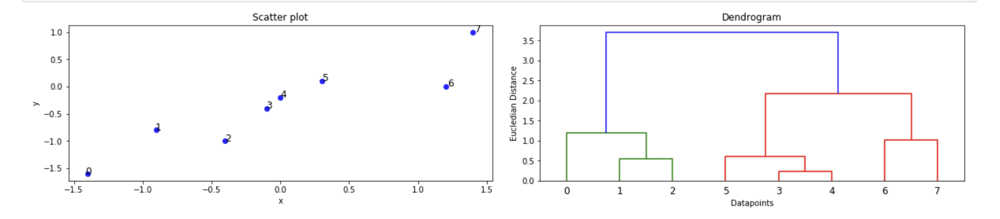

```{r setup, include=FALSE}
knitr::opts_chunk$set(echo = TRUE)
```

## What is Clustering?

Clustering means finding clusters in a dataset unsupervised.
Unsupervised in this case means that there are no predictor and response variables.

What we are going to learn here.

-   What is Clustering
-   What is a Cluster?
-   Difference between clustering and classification.
-   Uses of Clustering in different industries.

## Why clustering?

### Clustering algorithms.

#### Hierarchical Clustering -Deep dive.

### What is a Cluster?

A cluster is a group of objects that are similar to other objects in the cluster and dissimilar to data points in other clusters.

When observations are clustered in a particular dataset, they have partitioned into distinct groups in such a way that the observations within each group are very similar to each other.
Difference between clustering and classification.
Classification predicts categorical class labels which mean assigning instances to predefined classes in a supervised model while clustering simply groups similar observations together in an unsupervised fashion.

Uses of Clustering in different industries.

-   **Retail/Marketing**

    -   *Identifying buying patterns of customers.*
    -   *Recommending new books or movies to new customers*

-   **Banking:**

    -   *Fraud detection in credit card use*
    -   *Identifying clusters of customers*

-   **Insurance:**

    -   *Fraud detection in claims analysis.*
    -   *Insurance risk of customers.*

-   **Publication:**

    -   *Auto-categorizing news based on their content*
    -   *Recommending similar news articles*

-   **Medicine:**

    -   *Characterizing patient behavior*

-   **Biology:**

    -   *Clustering genetic markers to identify family ties.*

## Why clustering?

In data analysis we can make use of clustering to achieve the following:

1.  Exploratory data analysis.
2.  Summary Generation.
3.  Outlier detection.
4.  Finding duplicates
5.  Pre-processing step.

## Clustering algorithms.

Clustering is so popular in many fields and below are some of the clustering algorithms.

1.  Partition Based Algorithms:
2.  Hierarchical clustering:
3.  Density-Based algorithm
4.  K- Means Clustering.

## Hierarchical Clustering Algorithm.

This particular type of clustering method creates a tree-based representation of observations called a dendrogram.
Hierarchical clustering algorithms build a hierarchy of clusters where each node is a cluster consists of the clusters of its daughter nodes.
Hierarchical clustering strategies generally fall into two types:

1.  **Divisive (Top-down approach)** Start with all observations and break it down into smaller pieces.

2.  **Agglomerative(Bottom-up approach)** Each observation starts the cluster and pairs up as they move the hierarchy.
    Agglomeration simply means to collect things up.
    The agglomerative approach is very popular and works in a similar way which humans think.

## **Understanding a dendrogram and the agglomerative approach.**

*So how does it work?*

This method builds a hierarchy from individual elements by progressively merging clusters.

In a dendrogram, each leaf represents one of the data points.
As we move up the tree some observations fuse together to form branches.

These observations that fuse together are very similar to each other or close to one another.
Further up the tree, branches fuse with other branches or observations.

The height of the fusions indicates how the two observations or clusters are different.
Let me plot a simple plot of face data here to see how this comes about.



In the plot to the left, we can see the points plotted in a 2D scatter plot, and a dendrogram of the same is done in the second plot.

Let's understand how the program makes the dendrogram in the right figure.
Assume the points represent cities in Kenya and we want to cluster them based on their distance from each other.
Distance between the points can be calculated by many methods including euclidian distance.

Looking at the scatter plot on the left side points 3 and 4 are the closest therefore they will be fused together and they will form a cluster.
This leaves us with n -1 =7 clusters.
The distance between them is represented by the height of the cluster formed.

By checking the distance between points 1 and 2 relative to other points we find they are the closest so we will make a cluster with them.
Using the first cluster between 3 and 4 we can see that it's closer to five than the cluster between 1 and 2 so so we will fuse this cluster with point 5.

This process continues progressively up the tree to make the dendrogram.

## Identifying the clusters based on the dendrogram.

So how do we identify the clusters based on this dendrogram?
To get the optimal number of clusters, the dendrogram is cut at a point where the vertical lines are highest and not crossing any horizontal line.

## Hierarchical Algorithm.

After Understanding the concept, let's see the algorithm on how to build this in simple and easy to understand steps.
1.
Make each datapoint a single point cluster; from N clusters 1.
Take two closest data points and make them one cluster; forms N-1 clusters.
1.
Take the two closest clusters and make them one cluster; forms N-2 Clusters 1.
Repeat step 3 until there is one cluster remaining.
1.
Defining the Dissimilarity measure between two points.

A question arises on how we chose which cluster to be fused with which.
In simple terms how did we decide on the dissimilarity between two clusters?

This problem is easily solved by the concept of the linkage which defines the dissimilarity between two groups of observations.
There are 4 main types of linkages namely:

1.  **Complete linkage:** takes the largest of the dissimilarities between the observations in two clusters after computing all pairwise dissimilarities.
2.  **Average linkage** takes the average of the dissimilarities between the observations in two clusters after computing all pairwise dissimilarities.
3.  **Single linkage** takes the smallest of the dissimilarities between the observations in two clusters after computing all pairwise dissimilarities.
4.  **Centroid linkage**: takes the dissimilarity between the centroid of cluster A and centroid of cluster B

## Choosing the Dissimilarity Measure.

Choosing the dissimilarity measure in this algorithm depends on the domain knowledge of what one is doing.

Feature scaling is recommended in order to take care of outliers in the dataset.

The two decisions above are very fragile and should be made with great care as they greatly affect the result of the model.

See hierarchical clustering project in action here with python.

Thanks for reading, any comment and or suggestions are welcome.

```{=html}
<script src="https://utteranc.es/client.js"
        repo="GeorgeOduor/GeorgeOduor.github.io"
        issue-term="pathname"
        theme="github-light"
        crossorigin="anonymous"
        async>
</script>
```
